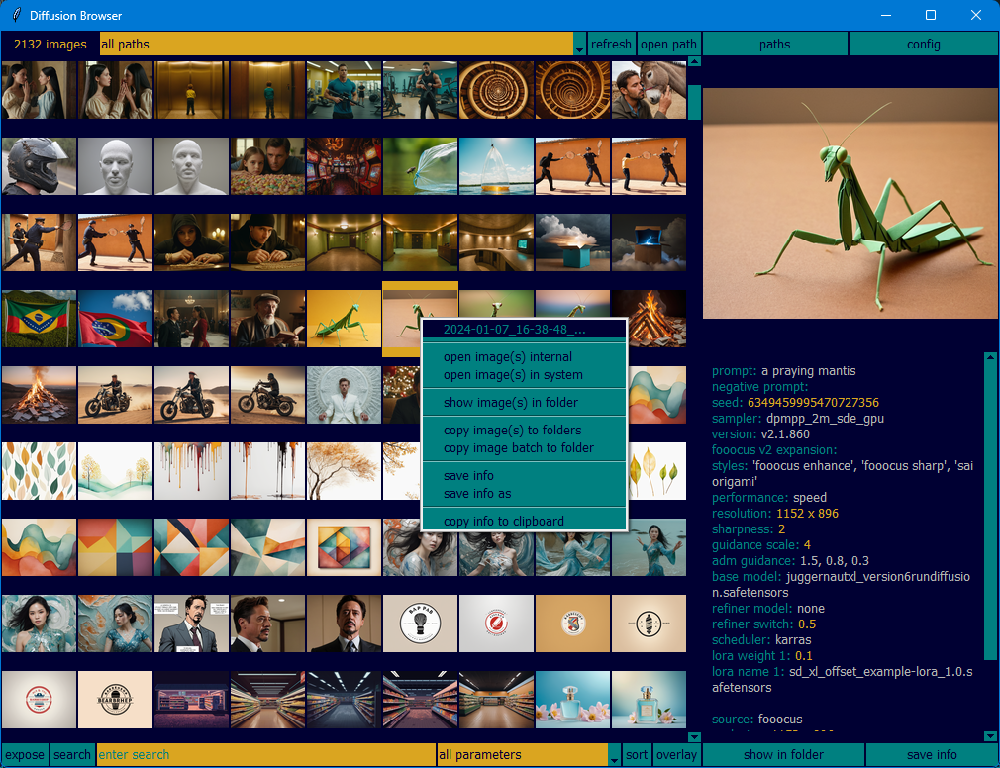
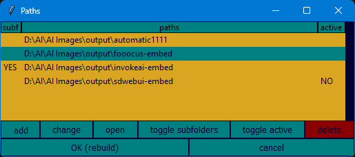

  
  
# Diffusion Browser  
**v3.1**  
An easy way to view embedded image metadata of some AI generators.  
  
**Smarter**  
**Diffusion Browser** now builds a database with all images information and saves it for later use.  
  
**Faster**  
The images are loaded on the fly when the program is first opened and on a few other occasions. The loading is threaded for faster response.  
> Still working to make images load even faster.  
  
**More versatile**  
You can set several folders where to look for images and set subfolder lookup individually.  
  
**Coming**  
Allow loading and saving multiple projects  
Add tags to the images  
Add stars to the images  
Create image sets  
Image viewer improvements with next/previous buttons and more  
Manage the parameters list inside the program  
Show all data available on a given parameter  
Find images by their content and not by their extensions  
Undock and dock the image and embedded info viewers  
More  
  
> On [Embedders](Embedders/README.md) there are scripts to embed information from some generators that do not embed them.  
   Four versions of **Fooocus** embedders and probably outdated versions of **invoke-ai** and **sd-webui**.  
  
>**Diffusion Browser** uses the **[Pillow](https://pillow.readthedocs.io/en/stable/)** module.  
  
## Main Interface  
  
(From top left, clockwise):  
  
- *Number of images found.*  
  
- *Image paths pull down box.*  
Paths to look for for the images.  
Click to chose an specific path to view.  
"all paths" will look into all available paths.  
  
- *refresh button.*  
Refresh the grid to sync added/deleted images on the configured paths.  
New images will be sorted according to their timestamps.  
  
- *open path button.*  
Open the file explorer pointing to the currently selected path.  
  
- *paths button.*  
Opens the path requester.  
[**More below**](#Paths-requester).  
  
- *config button.*  
Change Diffusion Browser's settings.  
[**More below**](#Configuration).  
  
- *Image preview.*  
Display the currently selected image.  
`Click` to open a [window with the full sized image](#Full-sized-image-view).  
`Shift+click` or `right click` to open the image on the default system viewer.  
  
- *Information viewer.*  
Display the embedded image information along with some extra content.  
[**More below**](#The-information-viewer).  
  
- *save info button.*  
Save the information of the info window to a text file with the same name as the image on the same folder.  
`Right click` to chose a different name.  
  
- *show in folder button.*  
Open the file explorer pointing to the currently selected image.  
  
- *overlay button*  
Overlay the parameter chosen on the parameter box to the grid images.  
`all parameters` or an empty box will clear the overlay.  
`Right click` or `shift+click` will also clear the overlay.  
  
- *Sort button*  
Sort the grid images according to the parameter chosen on the parameter box.  
Click again to reverse the sort.  
`all parameters` or an empty box will sort by timestamp.  
`Right click` or `shift+click` will also sort by timestamp.  
  
- *Parameters pull down box*  
A pull down box containing all the parameters available.  
Used to narrow the search or expose matches and to select the sort or overlay information.  
If using the `path` parameter, a path on the search box will be normalized.  
`all parameters` or an empty box will reset the functions.  
  
- *Search entry box*  
Enter the search string here.  
`Return` will show only the images matching the search.  
`Shift+return` will expose the search match.  
`Control+return` will clear the search.  
`Control+shift+return` will clear the expose.  
  
- *search button*  
Will search the images based on the search box entry.  
`Shift+click`/`shift+return`/`shift+space` will clear the search without erasing the search box.  
`Control+click`/`control+return`/`control+space` will invert the search match.  
`Alt+click`/`alt+return`/`alt+space` will search for the exact match.  
`Alt+control+click`/`alt+control+return`/`alt+control+space` will search for the inverted exact match.  
  
- *expose button*  
Will expose the images based on the search box entry.  
All non-matching images will be grayed out.  
`Shift+click`/`shift+return`/`shift+space` will clear the expose without erasing the search box.  
`Control+click`/`control+return`/`control+space` will invert the expose match.  
`Alt+click`/`alt+return`/`alt+space` will expose the exact match.  
`Alt+control+click`/`alt+control+return`/`alt+control+space` will expose the inverted exact match.  
  
- *Image grid*  
Show all images found on the current paths and subfolders.  
Click to select an image.  
Once clicked, use the arrow keys to navigate the grid.  
`Double click`/`return`/`space` opens the full version on the internal viewer.  
`Shift+double click`/`shift+return`/`shift+pace` opens the full version on the default system viewer.  
You can select multiple images to perform bath operations. Most menu items and keyboard shortcuts will affect all selected images.  
`Shift+arrows` toggle selects next image.  
`Shift+click` select multiple images.  
`Control+click` toggle selected image.  
`Right click` opens a context menu with functions for this image instead of the selected one.  
`Clicking` the image name on the context menu will copy its path.  
The context menu contains:  
   - The image name  
   open image(s) internal  
   open image(s) in system  
   show image(s) in folder  
   copy image(s) to folders  
   copy image batch to folder  
   save info  
   save info as  
   copy info to clipboard  
  
> **Some more keyboard shortcuts**:  
`Control+c`: Copy the selected image information to the clipboard.  
`Control+f`: Shows the current image on its folder.  
`Control+p`: Shows the current path.  
`Control+i`: Save the current info box content to a text file with the image name.  
`Control+shift+i`: Save the current info box content to a text file asking for a name.  
`Control+s`: Copy the selected image to another folder.  
`Shift+control+s`: Copy all selected images to a single folder.  
`Control+o`: Sort the images by the chosen parameter.  
`Control+shift+o`: Sort the images by timestamp.  
`Control+l`: Overlays the selected parameter on the grid images.  
`Control+shift+l`: Clears the overlayed parameters.  
`Control+r`: Refresh new/deleted images in the current path.  
`PageUp/PageDown`: Scroll the image grid by one page.  
`Home`: Go to the top of the grid.  
`End`: Go to the bottom of the grid.  
`Alt+up`: Go to the image one page above.  
`Alt+down`: Go to the image one page below.  
`Control+up`: Go to the first image.  
`Control+down`: Go to the last image.  
`Esc`: Cancel the progress when loading images. The images loaded so far are kept. The loading can be resumed with the refresh button.  
  
## Full sized image view  
  
  
The window can be resized and will show the image seed and file name.  
Esc closes the window if selected.  
  
## Paths requester  
  
  
Paths can be added, changed, opened and deleted.  
Toggle subfolders to enable recursion on that path.  
Toggle active to enable or disable that path.  
`Double clicking` on their columns will also toggle them.  
`Double clicking` a path name will change it.  
`Return`/`space` on a selected path will toggle subfolders.  
`Shift+return`/`Shift+space` on a selected path will toggle active.  
You can shift select multiple paths to perform an action.  
Click the headers to sort.  
Accepting this requester with different paths will rebuild the program database.  
  
## Configuration  
  
  
**The following can be configured:**  
The number of grid columns.  
The number of grid rows.  
Each grid image size.  
The preview image size.  
The height of the buttons (to compensate for font sizes).  
The font name.  
The font size.  
The font weight.  
The Background color.  
The Main color.  
The 1st accent color.  
The 2nd accent color.  
The alert color.  
  
>*The get font buttons all take to the same font requester.*  
*The configuration will be saved on an `.ini` file.*  
*If the interface exceeds the screen size a warning will be given.*  
  
## The information viewer  
Example:  
```yaml  
prompt: infinite jest book cover  
seed: 3547671229  
sampler: Euler a  
steps: 20  
cfg scale: 7  
size: 512x512  
model hash: 7460a6fa  
  
source: automatic1111  
real_size: 512 x 512  
format: png  
created: 05-10-2022 15:32:53  
path: <PATH TO>/<IMAGE>.png  
```  
To help visualize the parameters and its values, they are presented on different colors. The information window also reorders the parameters on a more intuitive way and display further information.  
To this end, the parameters are identified and stored on a file called `parameters.txt` inside `\Projects\Default` for further use.  
You can edit this file to change the order they appear on the information window.  
When new images are cataloged, a message will be shown if new parameters are discovered. They will be  automatically added to `parameters.txt` before the empty separator. They will also be copied to the clipboard.  
On the information window:  
Use the `mouse wheel` to scroll.  
Selected text will be automatically copied to the clipboard.  
`Right click` to copy all content.  
`Triple click` selects and copy a single parameter.  
The lines are reordered for a better presentation.  
If no compatible parameter is found, the raw information (if any) will be displayed under `embedded info:`.  
Some parameters have added numbers to keep their order.  
  
The default parameters are:  
```  
embedded info, raw prompt, raw negative prompt, prompt, negative prompt,  
negative_prompt, seed, sampler, sampler_name, steps, ddim_steps, ddim_eta,  
cfg scale, cfg_scale, cfgscale, width, height, size, initimg, strength,  
denoising strength, denoising_strength, first pass size, mask blur, n_iter,  
iterations, batch_size, batch size, batch pos, grid, batch, fit, progress_images,  
toggles, resize_mode, gfpgan_strength, upscale_level, upscale_strength, target,  
model, model hash, clip skip, model 1, upscale 1, visibility 1, model 2, upscale 2,  
visibility 2, version, fooocus v2 expansion, styles, performance, resolution,  
sharpness, guidance scale, adm guidance, base model, refiner model, refiner switch,  
scheduler, lora 1, weight 1, lora 2, weight 2, lora 3, weight 3, lora 4, weight 4,  
lora 5, weight 5, lora weight 1, lora name 1, lora weight 2, lora name 2,  
clipPoints, metadata scheme, lora_combined_1, refiner_switch, loras,  
prompt_expansion, adm_guidance, full_negative_prompt, full_prompt, guidance_scale,  
base_model_hash, base_model, refiner_model, created_by, user, lora hashes,  
metadata_scheme,  , source, real_size, format, created, path  
```  
  
## Changes  
v3.1  
- Added support for Fooocus and Fooocus a1111 native embedded metadata  
- Paths requester  
   - Toggle active or inactive folders  
   - Double clicking on subfolders or active on the paths requester will toggle them  
   - Double clicking on the path name will change it  
   - RETURN, SPACE on the paths requester will toggle subfolders  
   - SHIFT+RETURN, SHIFT+SPACE on the paths requester will toggle active  
   - Button to change the selected path  
- Image grid  
   -  Right click an image now selects it  
   -  SHIFT+UP became ALT+UP  
   -  SHIFT+DOWN became ALT+DOWN  
   -  Multi select images  
         - SHIFT+UP add select up  
         - SHIFT+DOWN add select down  
         - SHIFT+LEFT add select left  
         - SHIFT+RIGHT add select right  
         - shift+click select more  
         - control+click select toggle  
         - Menu title copy all selected  
         - Menu item perform on all images  
         - Keyboard shortcuts affects all selected images  
- Removed seed from the internal image viewer header  
- Optimizations  
   - Load images one by one instead of by rows (preparing for better optimizations)  
   - Functions to consolidate selected and unselected button state  
- Several small tweaks on the GUI  
   - Added Scrollbar to the information window  
   - Themed the scrollbars  
   - Exchanged open path and paths buttons positions  
   - Moved refresh and open path buttons  
   - Menu appearance  
   - Some state color changes  
- Added save batch to folder menu item  
   - SHIFT+CTRL+S activate batch copy  
- Paths combobox now show all paths containing images  
- Metadata errors now are displayed bunched together.  
- Metadata reading is more robust  
- Added a program icon  
  
v3.0 (beta)  
- Save image information database for later retrival  
- Image loaded on the fly, threaded for speed  
- Multiple paths with individual subfolder selection  
- Several new keyboard commands  
- search and expose by exact match  
  
v2.3  
- Sort by parameters  
- Show parameter overlay on the grid  
- Right click image preview to open in system default viewer  
- Page up and page down scroll grid by page  
- Right click on the info box copy all  its information  
- New context menu items  
- New keyboard shortcuts  
- Save image parameters information to a file  
- Show parameters on Automatic1111 Extras modules ordered  
- Control+button invert search and expose matches  
- Right click+button clears expose/search/overlay/sort  
- Show raw image information if no compatible parameter found  
- Better information parsing  
- Better internal data representations  
- Better config handling  
- Several config bug fixes  
- Alert color if config entry is invalid  
- Small GUI fixes  
  
v2.2  
- ESC cancels image loading  
- Shift-clicking the preview image opens it in the default system viewer  
- Shift+double click/return/space on a grid image opens it on the default system viewer  
- Right click grid images opens a context menu with some functions on that image  
- Ctrl+c copy the selected grid image to a folder  
- Show folder now selects the folder  
- Show in folder now selects the image  
- Show folder, show in folder and view in system now working on Linux and Mac OS  
- Mouse wheel now working on Linux and Mac OS  
- Automatically add new parameters to `parameters.txt`  
- Better embedded information parsing  
- Catch errors loading bad image files  
- Main widow resizable to avoid problem with window managers  
- Fixed image viewer window aspect ratio bug  
  
v2.1  
- Small interface improvements  
- Better arrow keys navigation  
- Selected image now highlighted on the grid  
- Return/space/double click a grid image opens the full version  
- Esc closes the full image window if selected  
- Search and expose images  
- Do not show grid progress while loading anymore but it's faster  
- Refresh (!) now only updates the new/deleted images.  
- Better configuration handling  
- Resizable font requester and configuration windows  
- Bigger font requester  
- Font preview while browsing  
- The preview text on the font requester can be changed  
- Arrows to change the size on the font requester  
  
## Linux stuff  
  
Installation (optional):  
- This will copy the program to a folder in the home directory and will put a desktop shortcut in the systems directory so every start menu and app launcher will find Diffusion Browser.  
Leave `Diffusion-Browser.desktop` and `linux-install.sh` in the main Diffusion Browser folder and run `linux-install.sh`.  
  
- To uninstall type:  
`rm -r $HOME/Diffusion-Browser`  
`rm ~/.local/share/applications/Diffusion-Browser.desktop`  
  
  
For KDE users  if main program window is buggy:  
- Press ALT + F3  
- Select "More Actions"  
- Select "Configure Special Windoww Settings"  
- Add Property  
- Size  
- Enter desired Size  
  
## Acknowledgments  
  
Many thanks to [RandomLegend](https://github.com/RandomLegend) not only for extensive testing, bug reporting and great feature ideas but also for actually contributing most of the Linux code and stuff.  
  
**Diffusion Browser** is offered as is, with no guaranties whatsoever, use at your own discretion.  
Enjoy and send feedback.  
Thanks.  
